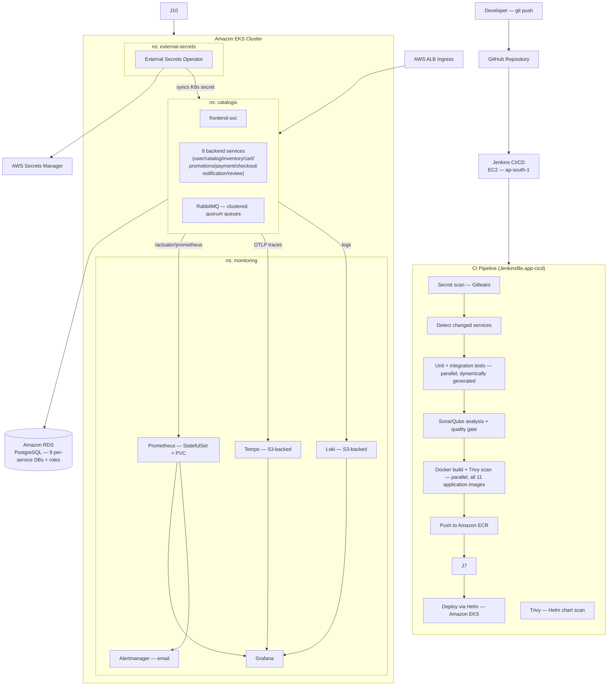

# End-to-End DevSecOps + Platform Engineering for Microservices

**Terraform · Jenkins · Ansible · Docker · AWS EKS · Helm · SonarQube · Trivy · Gitleaks · Prometheus · Grafana · Loki · Tempo · RabbitMQ · External Secrets Operator**

> A complete DevSecOps and platform-engineering delivery stack for a 9-service e-commerce backend on Amazon EKS — pipeline design, security integration, infrastructure automation, contract testing, production-aligned Kubernetes operations, and a real developer portal.

---

## Table of contents

- [What this project demonstrates](#what-this-project-demonstrates)
- [Tech stack](#tech-stack)
- [Architecture](#architecture)
  - [High-level flow](#high-level-flow)
  - [Infrastructure layers](#infrastructure-layers)
  - [EKS namespace layout](#eks-namespace-layout)
- [CI/CD pipeline stages](#cicd-pipeline-stages)
- [Security integration (DevSecOps)](#security-integration-devsecops)
- [Secrets management](#secrets-management)
- [Infrastructure (Terraform)](#infrastructure-terraform)
- [Server provisioning (Ansible + JCasC)](#server-provisioning-ansible--jcasc)
- [Bootstrap CLI (Python)](#bootstrap-cli-python)
- [Kubernetes hardening](#kubernetes-hardening)
- [Observability](#observability)
- [Platform engineering](#platform-engineering)
- [Local development](#local-development)
- [How to run](#how-to-run)
- [Design decisions and trade-offs](#design-decisions-and-trade-offs)
- [Known limitations and roadmap](#known-limitations-and-roadmap)
---

## What this project demonstrates

This project is not about the application — Catalogix is an e-commerce backend deliberately kept simple in its business logic (checkout, cart, catalog, payments) so it doesn't distract from what's actually being demonstrated: real distributed-systems and platform-engineering practices applied to a genuinely multi-service system, not a toy.

What is being demonstrated:

- **Automated, secure CI/CD** — a Jenkins pipeline that scans for secrets before doing anything else, dynamically generates parallel test/build/scan stages from a service list (adding a 10th service is a one-line change, not a new stage block), enforces a SonarQube quality gate, scans every Docker image and Helm chart with Trivy at severity thresholds that fail the build, and only then deploys via Helm to EKS
- **Infrastructure-as-code across two lifecycle layers** — a `bootstrap-infra` layer (VPC, subnets, gateways) that is applied once and left stable, and a `platform-infra` layer (EKS, RDS, ECR, ALB, ESO, S3+IRSA for Loki/Tempo) that reads VPC outputs from remote state and can be torn down and rebuilt independently
- **Zero-touch, per-service secrets** — every one of the 9 backend services gets its OWN database and role (not a shared master credential), generated by Terraform via the `postgresql` provider, stored in AWS Secrets Manager, synced into the cluster as a Kubernetes Secret by External Secrets Operator
- **Real observability, all three pillars** — metrics (Prometheus/Grafana), logs (Loki, S3-backed), and traces (Tempo, S3-backed) correlated in one Grafana, plus RabbitMQ queue-depth metrics and an alert on checkout-svc's compensation-outbox dead-letter count
- **Production-aligned Kubernetes** — non-root containers, read-only root filesystems, all capabilities dropped, startup/readiness/liveness probes on all services, HPA (min 2/max 4) across all 9 backend services plus frontend-svc and gateway, PodDisruptionBudgets, and explicit resource requests and limits
- **Repeatable infrastructure configuration** — Jenkins is not manually configured; Ansible provisions the EC2 and JCasC configures it on first boot with admin credentials, tool installations, pipeline jobs, and SonarQube connection all created automatically
- **Python CLI for local orchestration** — a structured Python CLI (`scripts/python/bootstrap.py`) replaces raw shell commands with dependency auto-install, interactive Ansible Vault setup, smart `terraform plan -detailed-exitcode` skip logic, EC2 health polling via `aws ec2 wait`, and subcommand routing — making the entire bootstrap reproducible from a single command

---

## Tech stack

| Category | Tools |
|---|---|
| Cloud | AWS (EKS, EC2, RDS, ECR, ALB, S3, Secrets Manager, IAM/IRSA) |
| IaC | Terraform |
| CI/CD | Jenkins (on EC2, configured via Ansible + JCasC) |
| Configuration management | Ansible (dynamic EC2 inventory, idempotent roles) |
| Containerisation | Docker (multi-stage builds, distroless runtime images) |
| Orchestration | Kubernetes (Amazon EKS) |
| Package management | Helm |
| Message broker | RabbitMQ (self-hosted in-cluster, quorum queues, HA-capable clustering) |
| Static analysis | SonarQube (separate EC2 instance, quality gate enforced) |
| Security scanning | Trivy (images + Helm/K8s manifests), Gitleaks |
| Secrets | AWS Secrets Manager + External Secrets Operator, per-service DB roles |
| Monitoring | Prometheus (StatefulSet + PVC), Grafana, Alertmanager (email) |
| Logs | Loki (S3-backed) + Promtail |
| Traces | Tempo (S3-backed), Jaeger for local dev |

| Bootstrap CLI | Python 3 (`scripts/python/`) — dependency check, vault setup, Terraform orchestration, EC2 polling |
| Application | Spring Boot (9 backend services), React + Nginx (frontend-svc) |
| Database | PostgreSQL (Amazon RDS) — one database + role per service |
 
---
 
## Architecture

### High-level flow

```
Developer git push
    └─▶ GitHub (webhook)
            └─▶ Jenkins EC2 (CI pipeline)
                    ├─▶ SonarQube EC2 (static analysis)
                    ├─▶ Amazon ECR (image push, 12 repos)
                    └─▶ Amazon EKS (Helm deploy)
                            ├─▶ ns: catalogix   (9 backend services, frontend-svc, gateway,
                            │                     RabbitMQ)
                            ├─▶ ns: monitoring  (Prometheus, Grafana, Alertmanager,
                            │                     Loki, Tempo)
                            └─▶ ns: external-secrets (ESO → Secrets Manager)
```

> The architecture diagram below is intentionally simplified to the CI flow and namespace shape — it doesn't attempt to draw all 9 backend services' individual dependency edges. See [ARCHITECTURE.md](ARCHITECTURE.md) for the full service-to-service call graph for the authoritative, machine-readable version of those relationships.



### Infrastructure layers

Infrastructure is split into two Terraform layers with separate lifecycles:

```
terraform/
├── bootstrap-infra/        # Apply once. VPC, subnets, NAT Gateway, IGW, route tables.
│                           # Outputs are written to S3 remote state.
└── platform-infra/
    └── env/dev/            # Reads bootstrap outputs via terraform_remote_state.
                             # (env/staging/ also exists, kept as a
                             # deliberately parallel example to demonstrate
                             # the multi-environment pattern — not the
                             # primary environment this doc walks through.)
        └── modules/
            ├── eks/                    # EKS, managed node group, OIDC, IRSA, gp3 StorageClass
            ├── ecr/                    # 10 private repositories (9 backend services + frontend-svc)
            ├── rds/                    # PostgreSQL instance, encrypted, private subnet
            ├── db-roles/               # Per-service databases + roles on that RDS instance
            │                           # (9 app services — 10 total,
            │                           # each with its own role scoped to its own database)
            ├── alb/                    # AWS Load Balancer Controller via Helm + IRSA
            ├── eso/                    # External Secrets Operator via Helm + ClusterSecretStore
            ├── observability-storage/  # S3 buckets + IRSA for Loki/Tempo
            ├── secrets-manager/        # Generic — used for db-credentials, app-secrets, alerting-secrets
            └── security-groups/        # Scoped per component; no open 0.0.0.0/0 rules
```

The `platform-infra` layer reads VPC and subnet IDs from `bootstrap-infra`'s S3-backed remote state. Network configuration can be updated without touching cluster resources.

 
> **Dev trade-off:** A single NAT Gateway is used to reduce cost. Production requires one NAT Gateway per AZ so a single AZ failure does not cut outbound internet access for all private subnets.
 
### EKS namespace layout
 
| Namespace | Workloads | Managed by |
|---|---|---|
| `catalogix` | frontend-svc, 9 backend services, RabbitMQ | Jenkins / Helm |
| `monitoring` | Prometheus, Grafana, Alertmanager, Loki, Tempo, kube-state-metrics, node-exporter | platform-infra pipeline / Helm |
| `external-secrets` | External Secrets Operator, ClusterSecretStore | Terraform (eso module) |
 
---
 
## CI/CD pipeline stages

Two pipelines — one per Jenkinsfile:

### `Jenkinsfile.app-cicd` — triggered on every push to main

| Stage | What it does |
|---|---|
| Secret scanning | Gitleaks scans the full git history; exits with code 1 on any finding |
| AWS authentication | `aws sts get-caller-identity` resolves account ID; sets ECR registry and image tag env vars |
| Detect changed services | git diff against the previous commit determines which of the 9 backend services actually changed — used to skip the (expensive) test stage for untouched services. Build/scan/push always run for every service regardless, since the Helm chart deploys all 9 under one shared image tag — see the comment at the top of Jenkinsfile.app-cicd for why partial skipping there would break the deploy |
| Hadolint | Dockerfile linting, all 11 application images, always runs (cheap) regardless of what changed |
| Unit + integration tests | Maven runs in parallel, dynamically generated from a service list (`BACKEND_SERVICES`) — only for changed services; service unit/controller suites run as part of the build |
| Build artifacts | `mvn package` and `npm run build` run in parallel for the 9 backend services + frontend; gateway is Nginx and is validated by Dockerfile lint + image build |
| SonarQube analysis | Sonar Scanner sends results to the SonarQube EC2; pipeline polls the quality gate and fails on breach |
| Docker build + Trivy scan | All 11 application images built and scanned in parallel via a shared-library function (`buildAndScanImage`); Trivy exits with code 1 on HIGH/CRITICAL findings (unfixed CVEs excluded via `.trivyignore` with documented justification) |
| Push to ECR | Images are tagged `MAJOR_VERSION-BUILD_NUMBER` and pushed to ECR, with retry |
| Helm chart scan | Trivy scans `helm/catalogix-hc` for Kubernetes misconfigurations; exits on CRITICAL |
| Fetch RDS endpoint | Retrieved from SSM Parameter Store — not hardcoded, not stored as a Jenkins credential |
| Helm deploy | `helm upgrade --install` deploys all 9 backend services + frontend-svc + gateway to the `catalogix` namespace on EKS |

### `Jenkinsfile.platform-infra` — triggered manually only

Supports `ACTION=Apply` (full provisioning) or `ACTION=Destroy` (double-gated: must also set `CONFIRM_DESTROY=true`).

Stages: terraform fmt check → init → validate → plan → human approval → apply → EKS cluster verification → metrics server → monitoring stack deploy (kube-prometheus-stack + Loki + Tempo) → monitoring stack verification.

---

## Security integration (DevSecOps)

Security is enforced at multiple points in the pipeline — it is not a post-deployment step.

| Control | Where | Failure mode |
|---|---|---|
| Secret scanning | Pre-build, every pipeline run | Build fails, no code runs |
| SonarQube quality gate | Post-build | Build fails, no image is pushed |
| Trivy image scan | After Docker build | Build fails, image is not pushed to ECR |
| Trivy Helm/K8s misconfiguration scan | Before deployment | Build fails, deploy does not run |
| Non-root containers | Kubernetes pod spec | Container will not start if misconfigured |
| Read-only root filesystem | Kubernetes security context | Container crashes on write attempt (by design) |
| All capabilities dropped | Kubernetes security context | Applies to all backend services |
| Secrets never in pipeline | ESO + Secrets Manager | No human or Jenkins credential ever holds a DB password, JWT secret, or RabbitMQ credential |
| EKS API endpoint scoped | Terraform — `public_access_cidrs` | Locked to Jenkins EC2 IP + deployer IP at apply time |

CVEs accepted via `.trivyignore` are documented with package name, CVE ID, severity, reason for acceptance, and a revisit condition.

---

## Secrets management

No database password, JWT secret, or RabbitMQ credential is ever known by a human or stored in any CI/CD credential.

**Flow:**

1. `terraform/platform-infra/modules/db-roles` generates a `random_password` PER SERVICE (not one shared master password) and creates a dedicated Postgres role + database for each of the 9 backend services via the `postgresql` provider
2. `terraform/platform-infra/env/dev/main.tf` merges all of those into ONE Secrets Manager write (`catalogix-dev/app-secrets`) — deliberately one resource, not two competing writers, since two Terraform resources both trying to own one secret's version is a real data-loss bug (whichever applies second overwrites the other's keys)
3. `terraform/platform-infra/modules/eso` installs External Secrets Operator and creates a `ClusterSecretStore` pointing to Secrets Manager via IRSA (trust policy scoped to only the ESO service account)
4. `helm/catalogix-hc/templates/external-secrets.yaml` defines two `ExternalSecret` resources (one for `db-credentials`, one for `app-secrets` via `dataFrom.extract` — copies every key verbatim, so a 10th service's credentials show up automatically with zero template changes) that instruct ESO to create and maintain the `catalogix-secrets` Kubernetes Secret, refreshing every hour
5. Each backend service's Deployment reads ITS OWN `db_user_<service>`/`db_password_<service>` key — not a shared credential — via `helm/catalogix-hc/templates/_helpers.tpl`'s `commonEnv` helper

The ESO IAM policy allows only `GetSecretValue` and `DescribeSecret`, scoped to `catalogix-dev/*`. No other pod in the cluster can assume the ESO IRSA role.

> **Why this matters for interviews:** Beyond "no human ever handles the password" — compromising one service's DB credentials no longer hands over the other 8 services' data, since each has its own role scoped to its own database. This is role-level isolation on a shared RDS instance, stated honestly — not instance-level isolation. All databases still live on the same underlying Postgres server, so the instance itself being down still affects every service.

---

## Infrastructure (Terraform)
 
### bootstrap-infra
 
Provisions the network foundation. Designed to be applied once.
 
- Custom VPC with DNS resolution and DNS hostnames enabled
- 2 public subnets (ALB, Jenkins EC2, SonarQube EC2) + 2 private subnets (EKS nodes, RDS)
- Internet Gateway, single NAT Gateway (see trade-offs)
- Kubernetes-required subnet tags applied at subnet creation so the ALB Ingress Controller can auto-discover them
### platform-infra modules
 
**EKS:**
- Managed node group, ON_DEMAND, sized 2/6/3 (min/max/desired) — bumped twice from an original 1/4/2 as the workload grew from 3 services to 9 backend services + frontend + in-cluster RabbitMQ (HA-capable, 3-replica clustering) + the full monitoring stack (Prometheus/Grafana/Loki/Tempo). Stated honestly as an estimate, not a measured figure — worth revisiting against real `kubectl top nodes` numbers
- Add-ons pinned to specific versions (`vpc-cni`, `coredns`, `kube-proxy`, `aws-ebs-csi-driver`) — prevents silent upgrades
- OIDC provider for IRSA
- EBS CSI driver with its own IRSA role scoped to only EBS provisioning permissions
- `gp3` StorageClass registered with `WaitForFirstConsumer` binding mode — not set as cluster default to avoid implicit volume provisioning
**RDS:**
- PostgreSQL 18.1 on `db.t4g.micro`
- `storage_encrypted = true`, `publicly_accessible = false`
- `skip_final_snapshot = true` — appropriate for dev; must be changed before any environment where data matters
- Master password generated by `random_password` — never visible in Terraform state as plaintext (stored encrypted). Used only by Terraform's own `postgresql` provider to create the 9+ per-service roles below (see modules/db-roles) — no app service ever authenticates with it directly
**db-roles:**
- Creates one database + one role PER SERVICE on the shared RDS instance (9 backend services) via the `postgresql` Terraform provider — role-level credential isolation, not just a naming convention
- Requires real network reachability from wherever `terraform apply` runs to the RDS endpoint on 5432 — already open via `modules/security-groups`' `rds_ingress_jenkins` rule
**observability-storage:**
- 2 S3 buckets (Loki logs, Tempo traces) with their own dedicated IRSA roles — deliberately separate from ESO's role, so a compromised Loki/Tempo pod can't reach Secrets Manager and vice versa
**ESO:**
- Installed via Helm, `wait = true` so CRDs are registered before `ClusterSecretStore` is created
- IAM trust policy scoped to `system:serviceaccount:external-secrets:external-secrets` only
---
 
## Server provisioning (Ansible + JCasC)
 
Jenkins is not manually configured. Running `ansible-playbook playbook.yaml` from a clean EC2 is the only setup step after Terraform applies.
 
**Playbook structure:**
 
| Play | Target | Roles |
|---|---|---|
| Common setup | `all` | `common` (baseline packages), `docker` |
| Jenkins setup | `jenkins` | `devops-tools` (kubectl, Helm, Trivy, AWS CLI, Sonar Scanner), `jenkins` |
| SonarQube setup | `sonarqube` | `sonarqube` (runs as Docker container) |
 
**Tool version management:** All tool versions are defined in `group_vars/all/vars.yaml` as a single source of truth. Each install task checks the currently installed version before downloading — re-running the playbook is idempotent.
 
**JCasC (`roles/jenkins/files/jcasc.yaml`) configures on first boot:**
- Admin user (credentials from environment variables — no hardcoded passwords)
- SonarQube server connection pointing to the SonarQube EC2
- Maven 3.9.9 and Node.js 22.15.0 tool installations
- AWS credentials, GitHub token, and SonarQube token loaded from environment variables as Jenkins credentials
- Both pipeline jobs (`platform-infra` and `app-cicd`) created automatically — Jenkins starts with both jobs already present
**Dynamic inventory:** `ansible/aws_ec2.yaml` discovers Jenkins and SonarQube instances by their EC2 tags. The inventory stays valid when instances stop and restart with new IPs — no hardcoded IP addresses.

---
 
## Bootstrap CLI (Python)
 
All bootstrap steps are orchestrated by a Python CLI at `scripts/python/bootstrap.py`. This is the intended entry point for setting up the project from scratch — not raw Terraform or Ansible commands.
 
### Structure
 
```
scripts/
└── python/
    ├── bootstrap.py          # CLI entry point — subcommand routing, dependency check, AWS auth check
    ├── backend_bootstrap.py  # Terraform backend-bootstrap orchestration
    ├── bootstrap_infra.py    # Terraform bootstrap-infra orchestration + EC2 health polling
    ├── ansible.py            # Vault setup + ansible-playbook execution
    └── utils/
        └── command.py        # run_command() — retry logic, friendly error messages, streaming output

```
 
### What the CLI handles
 
**Dependency management** — on startup, `bootstrap.py` checks for every required tool: `terraform`, `aws`, `ansible-playbook`, `ansible-galaxy`, `jq`, and the `boto3` Python package. If any are missing, it offers to auto-install them (single `apt-get update` pass for all missing packages together) or prints manual install commands and exits.
 
**AWS auth validation** — runs `aws sts get-caller-identity` before any Terraform command. Fails immediately with a clear message if credentials are not configured, rather than letting Terraform fail mid-apply with a cryptic error.
 
**Idempotent Terraform execution** — uses `terraform plan -detailed-exitcode` and inspects the exit code:
- Exit code `0` → no changes detected, skips `apply` entirely
- Exit code `2` → changes found, prints the plan, asks for confirmation, then applies
- Any other exit code → plan itself failed, exits with a clear error
This prevents re-applying an already-applied configuration and avoids silent failures.
 
**Interactive Ansible Vault setup** (`ansible.py`) — handles the full vault lifecycle without any manual file editing:
- If `~/.vault_pass` does not exist: prompts to create it with password confirmation
- If `vault.yaml` does not exist: prompts for all required secrets (Jenkins password, GitHub token, AWS credentials, SonarQube password) interactively with hidden input via `getpass`, writes the file, and encrypts it immediately with `ansible-vault encrypt`
- If the vault password is wrong: allows up to 3 re-attempts, then offers to delete and recreate the vault
- If both exist and the password is valid: skips all prompts and proceeds
**EC2 health polling** — after `terraform apply` for bootstrap-infra, reads the Jenkins and SonarQube instance IDs from Terraform outputs and calls `aws ec2 wait instance-status-ok`. Ansible does not run until both instances pass EC2 status checks.
 
**Retry logic with friendly errors** (`utils/command.py`) — all shell commands go through `run_command()`, which retries up to 3 times with exponential back-off. Known error patterns (S3 unreachable, AWS access denied, invalid Ansible Vault password, Terraform config error) are matched and replaced with a single actionable message instead of raw stderr.
 
**Subcommand routing** — supports four modes:
 
```bash
python3 bootstrap.py           # full: backend → infra → ansible (default)
python3 bootstrap.py backend   # S3 backend only
python3 bootstrap.py infra     # bootstrap-infra only (assumes backend exists)
python3 bootstrap.py ansible   # Ansible only (assumes EC2s are running)
```
 
This allows re-running individual phases without repeating the entire flow — useful when Ansible fails after infra is already applied.
 
### Why Python over Bash
 
The bash scripts are simpler and do the same core job. The Python CLI was written to solve problems the bash scripts do not handle:
 
- Bash has no structured vault management — the bash script passes `--vault-password-file` but does not create or validate the file
- Bash has no dependency auto-install — it checks and exits, requiring manual intervention
- Bash has no idempotent plan logic — it always runs `plan` and `apply` regardless of whether changes exist
- Python's `subprocess` gives clean stdout streaming for long-running commands (Terraform apply, Ansible playbook) without buffering issues that affect bash `$()` capture
Both are kept in the repo. Use whichever fits your workflow.
 
---
 
## Kubernetes hardening
 
All backend service containers run with this security context:
 
```yaml
securityContext:
  runAsNonRoot: true
  runAsUser: 1000
  readOnlyRootFilesystem: true
  allowPrivilegeEscalation: false
  capabilities:
    drop:
      - ALL
```
 
**`readOnlyRootFilesystem: true` with Spring Boot:** Embedded Tomcat writes to `/tmp` during startup. An `emptyDir` volume is mounted at `/tmp` in every backend Deployment. Without it, the container crashes on startup with a permission error — this was discovered and fixed during testing.
 
**`NET_BIND_SERVICE` on the gateway:** The gateway Nginx container binds port 80, so it is granted only `NET_BIND_SERVICE`; all other capabilities remain dropped. `frontend-svc` listens on port 11000 as non-root, so it needs no extra capability. Keeping the gateway on 80 and the frontend on 11000 also makes the edge topology explicit: host/ALB → gateway:80 → frontend-svc:11000.
 
**Health probes on all services:**
- `startupProbe` — `/actuator/health` every 5s, `failureThreshold: 30` (150s total) for JVM startup
- `readinessProbe` — `/actuator/health/readiness` — traffic is only routed to passing pods
- `livenessProbe` — `/actuator/health/liveness` — restarts pods in non-recoverable states
**HPA:** Configured for all 9 backend services plus `frontend-svc` and `gateway` (`minReplicas: 2`, `maxReplicas: 4`, CPU target 75% where configured). The `replicas` field is intentionally omitted from Deployment specs when HPA is enabled to avoid conflict with HPA replica management.
 
**PodDisruptionBudgets** are defined for all services to ensure availability during node drains.
 
---
 
## Observability

Monitoring is deployed as cluster-level infrastructure by the platform pipeline — not the application pipeline — so Prometheus is not restarted on every code push.

**Metrics** (namespace: `monitoring`):
- Prometheus (StatefulSet + PVC on `gp3`)
- Grafana (dashboards exported as JSON, version-controlled)
- Alertmanager — email only (SMTP), deliberately not also wired to Slack/PagerDuty: this is meant to demonstrate the actual pipeline (Terraform → Secrets Manager → ESO → mounted file → Alertmanager config), and one working channel proves that just as well as three would
- kube-state-metrics, node-exporter (via kube-prometheus-stack)
- RabbitMQ queue depth, consumer count, and unacked messages — the `rabbitmq_prometheus` plugin exposed on port 15692, no separate exporter sidecar needed

**Logs:** Loki (single-binary mode, S3-backed via `modules/observability-storage`'s dedicated bucket + IRSA role) + Promtail (DaemonSet, auto-discovers every pod's stdout/stderr — a 10th service's logs are picked up with zero config changes). Local dev keeps using plain `docker logs`; Loki is cluster-only.

**Traces:** Tempo (S3-backed, same pattern as Loki). Local dev keeps using Jaeger (already working, no reason to migrate it) — Tempo is additive for the cluster, not a replacement for local dev's tracing setup. Every backend service's `OTLP_ENDPOINT` points at Tempo's OTLP HTTP receiver directly — no separate OTel Collector, unnecessary at this scale.

**Grafana correlates all three** — a single datasource ConfigMap wires Loki↔Tempo trace/log correlation (click a trace, jump to its exact logs; click a log line's trace ID, jump to that trace), using the same sidecar mechanism Grafana already uses to auto-load dashboards.

**Metrics collection:** Services are annotated for Prometheus autodiscovery, port varying per service (see `helm/catalogix-hc/values-dev.yaml`):

```yaml
prometheus.io/scrape: "true"
prometheus.io/path: /actuator/prometheus
prometheus.io/port: "<service-specific port, e.g. 11007 for checkout-svc>"
```

Metrics collected: service availability (`up`), HTTP request rate, 5xx error rate, latency P95 (histogram), JVM CPU usage, JVM heap memory usage, RabbitMQ queue metrics, and `checkout_outbox_dead_letter_count`/`checkout_outbox_pending_count` (custom Micrometer gauges — see below). All labeled by `service` and `namespace`.

**Alert rules (PrometheusRule resources, 5 groups):**
- `ServiceDown` — service disappears from Prometheus targets
- `HighCPUUsage` — CPU above 80% sustained
- `HighJVMMemoryUsage` — JVM heap exceeds threshold
- `PodCrashLooping` — 3+ restarts in 15 minutes (`kube_pod_container_status_restarts_total`)
- `OutboxDeadLetterBacklog` — checkout-svc's compensation outbox (see [ARCHITECTURE.md](ARCHITECTURE.md) for what this is) has a DEAD_LETTER entry sitting for 10+ minutes. This metric doesn't self-heal — it only drops when someone manually resolves the row via the admin UI (`/admin/outbox` — see `frontend-svc/src/components/OutboxAdmin.jsx`), so any nonzero value is worth paging on

Alerts were validated by scaling services to zero replicas and observing alert state transitions through `pending → firing`.

---


## Local development

The full stack runs locally using Docker Compose; only the gateway is published as the browser-facing application entry point:

```bash
cp .env.example .env
# Fill in POSTGRES_USER, POSTGRES_PASSWORD, POSTGRES_DB

docker compose up --build
```

Every service now has an explicit `mem_limit`, matching the Helm chart's own per-service resource limits — added after a real, evidenced problem: without it, every Java service's `-XX:MaxRAMPercentage=75` computes 75% of the ENTIRE HOST's RAM independently, per service. With 9 JVMs running at once, that's not a minor inefficiency on a resource-constrained machine, it's usually the actual cause. Total ceiling across all 15 services is ~5.9GB.

If you're still tight on resources: Jaeger and Mailpit are genuinely optional (nothing depends_on them) and are gated behind a `tools` profile, off by default:

```bash
docker compose up                        # everything except Jaeger/Mailpit
docker compose --profile tools up        # add tracing UI + mail catcher back in
docker compose up postgres rabbitmq payment-svc   # a single service in isolation, for backend-only work
```

The frontend is a static SPA and no longer depends directly on backend containers; the gateway owns the backend startup dependencies because it is the browser-facing application edge. Testing through the UI still brings up the services needed for the gateway routes.

| Service | Port | Notes |
|---|---|---|
| `postgres` | 5432 | Single instance, one database per service (see `postgres-init/`) — healthcheck: `pg_isready` |
| `rabbitmq` | 5672 (AMQP), 15672 (management UI) | user-svc/checkout-svc publish, notification-svc consumes |
| `mailpit` | 8025 | Optional (`tools` profile) — dev SMTP catcher |
| `jaeger` | 16686 | Optional (`tools` profile) — distributed tracing UI |
| `user-svc` | 11001 | Auth, JWT issuance |
| `catalog-svc` | 11002 | Product catalog |
| `inventory-svc` | 11003 | Stock levels — internal-only in the cluster, but reachable directly here for local testing |
| `cart-svc` | 11004 | Shopping cart |
| `promotions-svc` | 11005 | Coupons/discounts |
| `payment-svc` | 11006 | Payment processing — internal-only in the cluster |
| `checkout-svc` | 11007 | Saga orchestrator — the compensation outbox admin API (`/admin/outbox`) and returns live here too |
| `notification-svc` | 11008 | RabbitMQ consumer + admin-only notification log (`/notifications`) |
| `review-svc` | 11009 | Product reviews |
| `frontend-svc` | 11000 (internal) | Nginx SPA server; not published to the host |
| `gateway` | 11000 → 80 | Sole browser-facing entry point; routes `/api/*`, rate-limits requests, and forwards non-API traffic to frontend-svc; also sits behind the AWS ALB in EKS |

`condition: service_healthy` on the gateway's `frontend-svc` dependency prevents the gateway from advertising the application edge before the SPA server is ready; backend dependencies are only started before the gateway attempts to route to them.

---


## How to run
 
> **Prerequisites:** 
- AWS account (ap-south-1 by default — change `AWS_REGION` and `CLUSTER_NAME` in both Jenkinsfiles accordingly)
- Terraform >= 1.12.0 
- Ansible
- Python >=3.0
- AWS CLI configured with sufficient IAM permissions.

### Option A — Python CLI (recommended)
 
The CLI handles dependencies, vault setup, Terraform orchestration, and EC2 health checks automatically.
 
```bash
cd scripts/python
 
# Full bootstrap: S3 backend → VPC + EC2 infra → Ansible config
python3 bootstrap.py
 
# Or run individual phases:
python3 bootstrap.py backend   # S3 backend only
python3 bootstrap.py infra     # bootstrap-infra Terraform only
python3 bootstrap.py ansible   # Ansible only (EC2s must already be running)
```
 
On first run, the CLI will:
1. Check for missing dependencies (`terraform`, `aws`, `ansible-playbook`, `jq`, `boto3`) and offer to auto-install them
2. Validate AWS credentials with `aws sts get-caller-identity`
3. Create the S3 Terraform state backend (skips if already exists)
4. Ask for confirmation before `terraform apply` — prints the plan first
5. Prompt for Ansible Vault password and all secrets interactively (input is hidden)
6. Wait for EC2 instances to pass status checks before running Ansible
7. Run `ansible-playbook` — Jenkins comes up fully configured with both pipeline jobs ready
 
### Option B - Manual Operations

**Step 1 — Bootstrap networking**
 
```bash
cd terraform/bootstrap-infra
cp terraform.tfvars.example terraform.tfvars  # fill in your values
terraform init
terraform apply
```
 
This creates the VPC, subnets, and writes outputs to the S3 backend defined in `backend-bootstrap/`.
 
**Step 2 — Provision and configure CI/CD servers**
 
```bash
cd terraform/bootstrap-infra
# Note the Jenkins and SonarQube EC2 public IPs from outputs
 
cd ansible
# Update group_vars/all/vars.yaml with your GIT_REPO_URL
# Export credentials Jenkins will need:
export JENKINS_ADMIN_USER=admin
export JENKINS_ADMIN_PASSWORD=<your-password>
export GITHUB_TOKEN=<token>
export SONARQUBE_TOKEN=<token>
 
ansible-playbook playbook.yaml
```
 
Ansible discovers the EC2 instances by tag using the dynamic inventory in `aws_ec2.yaml`. After the playbook completes, Jenkins is fully configured — both pipeline jobs are present and ready.
 
### Step 3 — Provision platform infrastructure
 
In Jenkins, trigger `Jenkinsfile.platform-infra` manually with `ACTION=Apply`. This runs:
- Terraform (fmt → init → validate → plan → human approval → apply)
- EKS cluster verification
- Metrics server
- Monitoring stack deployment (kube-prometheus-stack + Loki + Tempo, via Helm)

### Step 4 — Deploy the application
 
Push to the `main` branch. `Jenkinsfile.app-cicd` triggers automatically and runs the full pipeline from secret scanning through Helm deployment.

### Destroy infrastructure
 
```bash
# Destroy bootstrap-infra (EC2s, VPC — does NOT touch platform-infra):
cd scripts/python
python3 destroy_infra.py
# Prints the destroy plan, asks for explicit confirmation before proceeding.
```
 
Platform infrastructure (EKS, RDS, ECR) is destroyed by triggering `Jenkinsfile.platform-infra` in Jenkins with `ACTION=Destroy` and `CONFIRM_DESTROY=true`.
 
---
 
## Design decisions and trade-offs
 
### 1. Jenkins on EC2 over a managed CI/CD service
 
Jenkins was chosen over GitHub Actions or AWS CodePipeline to reflect self-managed CI/CD environments common in enterprises and mid-size product companies. It required solving a real configuration problem — how to provision and configure Jenkins repeatably — which led to the JCasC + Ansible design. A managed service would have removed that engineering problem from the project scope entirely.
 
**Trade-off:** More operational overhead — Jenkins infrastructure needs to be provisioned, patched, and maintained.
 
### 2. SonarQube on a separate EC2 instance
 
Static analysis is CPU and memory intensive. Running SonarQube on the same instance as Jenkins causes resource contention during pipeline execution. Separation mirrors how most teams actually run SonarQube — as a long-lived shared service, not co-located with build infrastructure.
 
**Trade-off:** Additional EC2 cost and a second server to manage.
 
### 3. External Secrets Operator over Jenkins credentials
 
The original design stored the DB password as a Jenkins credential. This was replaced with ESO because: the password no longer needs to be known by anyone, secrets stay in sync with Secrets Manager automatically every hour, and the Jenkins pipeline has no dependency on a sensitive credential value.
 
**Trade-off:** ESO is an additional cluster component that must be provisioned and kept running. If ESO goes down, secret sync stops (existing secrets remain valid until the pod restarts or the K8s Secret is deleted).
 
### 4. Two-layer Terraform (bootstrap-infra + platform-infra)
 
The VPC can be modified independently without risk to the EKS cluster. The cluster can be torn down and rebuilt without re-provisioning the network. `platform-infra` reads VPC outputs via `terraform_remote_state` — subnet IDs are never manually copied between layers.
 
**Trade-off:** Two separate `terraform apply` operations required for initial setup. Apply order is enforced by convention, not code.
 
### 5. Monitoring deployed by the platform pipeline, not the application pipeline
 
Monitoring is cluster-level infrastructure. Deploying it from the application pipeline would mean every code commit potentially restarts Prometheus. Prometheus manages its own state (StatefulSet + PVC) — a restart mid-scrape is disruptive.
 
**Trade-off:** A separate manual trigger is required to update the monitoring stack.
 
### 6. Trivy `--ignore-unfixed` flag
 
Unfixed CVEs have no available patched version — blocking a deployment on them provides no security benefit. Accepted findings are documented in `.trivyignore` with package name, CVE ID, severity, reason, and a revisit condition.
 
**Trade-off:** Unfixed vulnerabilities are not surfaced in pipeline output, which could mask them from the team. Compensating control: `.trivyignore` is version-controlled and reviewed at base image updates.

### 7. Python CLI alongside Bash scripts
 
The bash scripts were written first. They are simpler and sufficient for a single run. The Python CLI was written to solve problems that kept coming up during repeated runs: missing tools caused mid-run failures with cryptic errors, the vault password file had to be created manually before every fresh setup, and there was no way to skip Terraform apply when nothing had changed.
 
The bash scripts are kept because they are easier to read and audit quickly. The Python CLI is the recommended entry point because it handles edge cases the bash scripts do not.
 
**Trade-off:** Python 3 must be available on the operator's machine. On minimal Linux installs it may not be. The bash scripts work on any system with bash.
 
---
 
## Known limitations and roadmap

| Limitation | Status / planned fix |
|---|---|
| IAM user credentials used only for initial bootstrap | Already replaced by EC2 instance profiles post-bootstrap — see `bootstrap-infra/iam.tf`. Static credentials are only needed before the EC2s exist. |
| Single NAT Gateway | One NAT Gateway per AZ for production multi-AZ HA |
| HTTP only | ACM certificate + HTTPS listener — Ingress template comments document the exact annotations needed |
| `skip_final_snapshot = true` on RDS, `force_delete = true` on ECR, Secrets Manager `recovery_window_in_days = 0` | All three are convenient dev-only shortcuts, never made environment-aware (e.g. flipped for staging/prod) — flagged repeatedly, not yet acted on |
| RabbitMQ defaults to 1 replica, not the 3 it's built to cluster to | Deliberate, not an oversight: on a small node group, 3 replicas often means multiple stacked on the same node — real HA needs ≥3 nodes each hosting exactly one replica, or it's theater, not protection. The clustering code (RBAC, Erlang cookie, quorum queue declarations) is real and correct either way; bump `rabbitmq.replicas` once the node count actually supports it |
| `env/staging/` exists but isn't kept in lockstep with `env/dev/` | Deliberately — it demonstrates the multi-environment pattern itself, not a second fully-maintained environment. |
| `ALLOWED_ORIGINS: "*"` on backend services | Scope to the ALB hostname in staging and production values files |
| NetworkPolicies not enforced | A deliberate call for this project's current stage, not a gap being tracked toward a fix |
| Infrastructure validation is static, not tool-verified | Terraform/Helm/most Java has been cross-referenced and traced by hand (catching real bugs this way), not run through a real `terraform plan`/`helm template`/`mvn compile`. The frontend is the only genuine exception — actually installed, built, and run for real during this project's development that static review never would have surfaced |

These are acknowledged trade-offs made to keep the project focused and deployable within a single AWS account on a dev budget — stated honestly rather than presented as finished.

